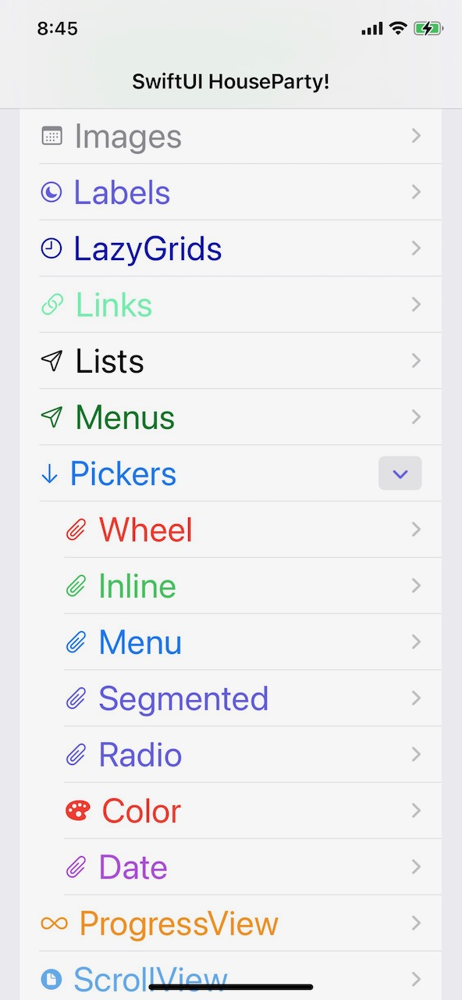
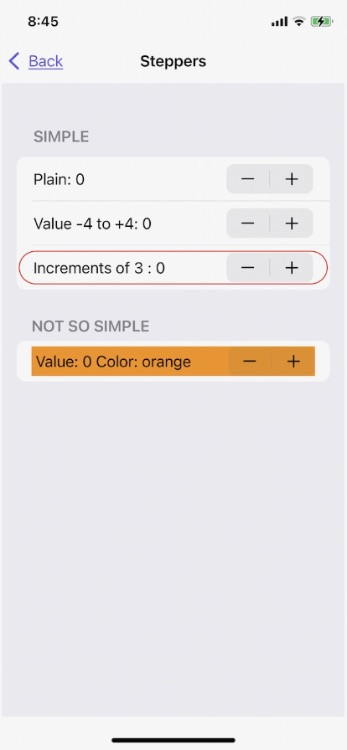
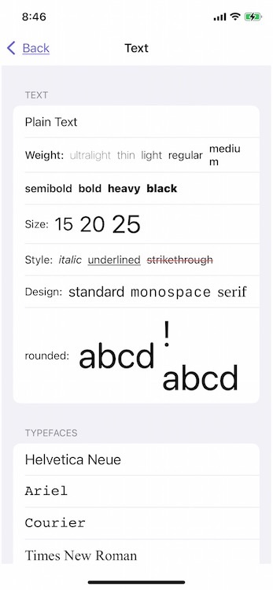

## This app was created as a deep-dive into SwiftUI.

And boy-howdy has it been fun.

  

0.9

  
Credits: 

Numerous sites helped me on this project
 - https://designcode.io/swiftui-handbook
 - Paul Hudson's terrific [HackingWithSwift](https://www.hackingwithswift.com) site.
 - [SwiftWithMajid](https://swiftwithmajid.com), who also posts a weekly article on Medium
 - [Serial Coder](https://serialcoder.dev/text-tutorials/swiftui/progressview-in-swiftui/) for ProgressView
 - And [this writeup](https://alfianlosari.medium.com/building-expandable-list-with-outlinegroup-disclosuregroup-in-swiftui-2-0-aa9dda14bbab) on Medium collapsable lists using DisclousureGroup
 - Apple.com with their superb example of SwiftUI using their [LandMarks project](https://developer.apple.com/tutorials/swiftui)

This project contains short concise examples of most if not all of SwiftUI controls.

 

What follows are various notes for each of the examples.

 1. Alerts and Sheets
	 1. On the iPhone, popovers look like the standard sheets
	 2. On the iPad they look like tooltips
 2. ButtonStyle
	 1. I've not been able to turn of the underlined button title. It seems like it should be underline free,  link or no link
	 2. I've not had any luck with the new iOS15 LocationButton, which merely asks the user to allow  an app to get LocationManager
 3. DynamicViewContent
	 1. This gives you the option of editing or deleting list items with the traditional swipe-left or the red buttons on the left side
 4. List items
	 1. Notice that the color list items use the color "primary" instead of the usual .foreground or .accent
 5. Forms
	 1.	One of the best parts of SwiftUI the creation and populating of forms
	 2.	Certifiable "breeze" to use
	 3.	Dark mode is handled automatically for text that is not specifically colored.
	 4.	 Reference to a $Binding var inside the init() function of another object, var must be proceded with an "_" but nowhere else
 6. Geometry Reader
	 1.	This is used to get some more concrete information about the devices display if precision sizing and positioning is needed.
	 2.	The Shapes example from Apple's terrific Landmark app
	 3.	She Shapes below
 7. Groupbox
	 9. This example uses a very basic Scrollview and group boxes as custom cells, in such an astonishingly easy way to get a custom list. Compared to UIKit...well...that is the stuff of nightmares.
	 10. Note the use of the Divider(), which draws faint lines to isolate different parts of the View.
	 11. The "spacing" settles on a fairly large gap between the cells by default, so -25 was used to close them together.
 8. Groups
		1. *DisclosureGroup* is a ViewBuilder, so it allows you to pack in dissimilar cells/controls
		2. *OutlineGroup* requires a list of like-items, text, maybe some images with the text, but is fundementally like a nested List. It can have mulitple nested groups as well 
3. Images
	1. Clipping via irregular objects
		1. Notice the clipping of an image into a circle or other shapes
	2. Conditional modifiers and SwiftUI limitations 
		1. Any func created inside a body of a SwiftUI View, *must* return a View, whether inferred or directly using "return objectView"
		2. All others either *must* be called from
			1.  outside of a View's body as part of the initialization 
			2. inside a ViewBuilder, as they have a standard, more or less, initializer
			3. a closure such as .onClick
		3. This means a grouping struct, such as the stacks or Group can only host funcs that return a View 
		4. So an if cannot be directly used in a View's body 
			5. a View can be extended to support custom *if*, see the  invert color block as an example
4. Pickers
	1. Another complicated item that has become a pleasure to use.
	2. Pickers are more abstracted then in UIKit as they merely offer another means to a list of possible mutually exclusive choices. Then you can select what type of picker to use, virtually seamlessly.
	3. The menu-picker style seems to be a menu in most if not all ways. Not quite sure what the difference really is.
    
     
   
5. ProgressView
	1. Nice example here of basic Combine interaction and use of the timer   
	2. Thanks to: https://serialcoder.dev/text-tutorials/swiftui/progressview-in-swiftui/
6. Shapes
	1. This comes almost entirely from Apples terrific Landscapes demo SwiftUI app.
	2. Both Shapes and Animation can get to be very involved, they deserve their own demo app.
	3. Note the use of GeometryReader
7.	Slider
	1. Yet another good Combine example and the type of thing it was designed for: Allowing n arbitrary number of objects needing to work/set the same data elements.
	2. Saves so much work by not having to do notifications management. Especially the problem on keeping multiple controls synced with possible conflicting notification messages
8.  Steppers
     
    
9.  Tabview
	1. Note that there is no support for tabviews along the top of the screen. 
10. Text
     
    
10.	@Viewbuilders
	1. Custom container used to create views out of many arbitrary subviews.
	2. Has a standard init method which can have access to standard Swift code, making various decisions at that level ahead of the body definition
	3. H/X/VStacks are Viewbuilders for example.
	4. They take up to 10 subviews of any type and organize them vertically for a VStack, horizontally for an HStack, and Diagonally for a DStack.
11. UIKit Integration
	1. Once of the many nice things about SwiftUI is that it can coexist with UIKit.
		1. I've added two SwiftUI panes in Distant Suns, which is an unholy amalgam of C++/ObjC/Swift/UIKit/SwiftUI
		2. However, going backwards with UIKit embedded in a SwiftUI View is a little more involved, but this example was kept simple
---
Advanced SwiftUI gallery
	1.	ResultBuilders
	2.	Complex Animations
	3.	Alignment Guides

